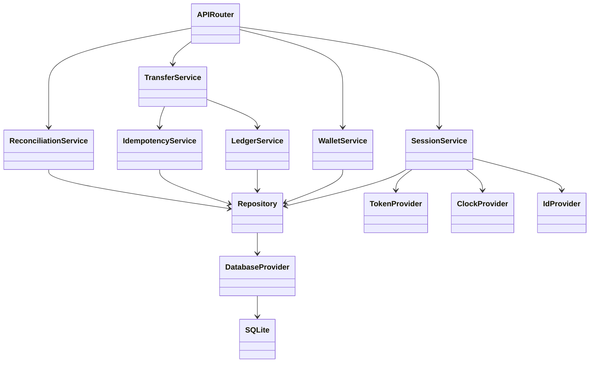

# Component Diagram

```mermaid
classDiagram
    APIRouter --> SessionService
    APIRouter --> WalletService
    APIRouter --> TransferService
    APIRouter --> ReconciliationService

    TransferService --> LedgerService
    TransferService --> IdempotencyService

    SessionService --> Repository
    WalletService --> Repository
    LedgerService --> Repository
    IdempotencyService --> Repository
    ReconciliationService --> Repository

    Repository --> DatabaseProvider
    DatabaseProvider --> SQLite

    SessionService --> TokenProvider
    SessionService --> ClockProvider
    SessionService --> IdProvider

    class APIRouter
    class SessionService
    class WalletService
    class TransferService
    class LedgerService
    class IdempotencyService
    class ReconciliationService
    class Repository
    class DatabaseProvider
    class ClockProvider
    class IdProvider
    class TokenProvider
    class SQLite
```

The diagram represents the proposed software components and their
dependencies.

Related requirements: SE-1, C-3, C-5.