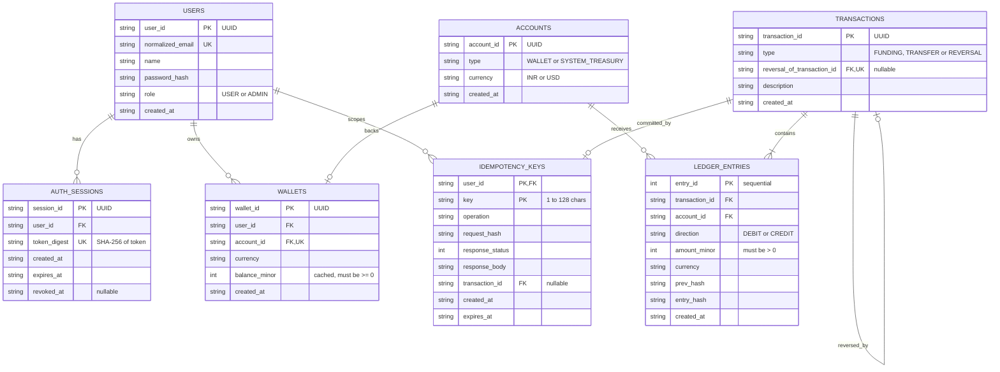

# ER Diagram

```mermaid
erDiagram
    USERS ||--o{ AUTH_SESSIONS : has
    USERS ||--o{ WALLETS : owns
    USERS ||--o{ IDEMPOTENCY_KEYS : scopes
    ACCOUNTS ||--o| WALLETS : backs
    ACCOUNTS ||--o{ LEDGER_ENTRIES : receives
    TRANSACTIONS ||--|{ LEDGER_ENTRIES : contains
    TRANSACTIONS ||--o| TRANSACTIONS : reversed_by
    TRANSACTIONS ||--o| IDEMPOTENCY_KEYS : committed_by

    USERS {
        string user_id PK "UUID"
        string normalized_email UK
        string name
        string password_hash
        string role "USER or ADMIN"
        string created_at
    }
    AUTH_SESSIONS {
        string session_id PK "UUID"
        string user_id FK
        string token_digest UK "SHA-256 of token"
        string created_at
        string expires_at
        string revoked_at "nullable"
    }
    ACCOUNTS {
        string account_id PK "UUID"
        string type "WALLET or SYSTEM_TREASURY"
        string currency "INR or USD"
        string created_at
    }
    WALLETS {
        string wallet_id PK "UUID"
        string user_id FK
        string account_id FK, UK
        string currency
        int balance_minor "cached, must be >= 0"
        string created_at
    }
    TRANSACTIONS {
        string transaction_id PK "UUID"
        string type "FUNDING, TRANSFER or REVERSAL"
        string reversal_of_transaction_id FK, UK "nullable"
        string description
        string created_at
    }
    LEDGER_ENTRIES {
        int entry_id PK "sequential"
        string transaction_id FK
        string account_id FK
        string direction "DEBIT or CREDIT"
        int amount_minor "must be > 0"
        string currency
        string prev_hash
        string entry_hash
        string created_at
    }
    IDEMPOTENCY_KEYS {
        string user_id PK, FK
        string key PK "1 to 128 chars"
        string operation
        string request_hash
        int response_status
        string response_body
        string transaction_id FK "nullable"
        string created_at
        string expires_at
    }
```

Notes: WALLETS has UNIQUE(user_id, currency). ACCOUNTS has one SYSTEM_TREASURY per currency. LEDGER_ENTRIES is append-only.