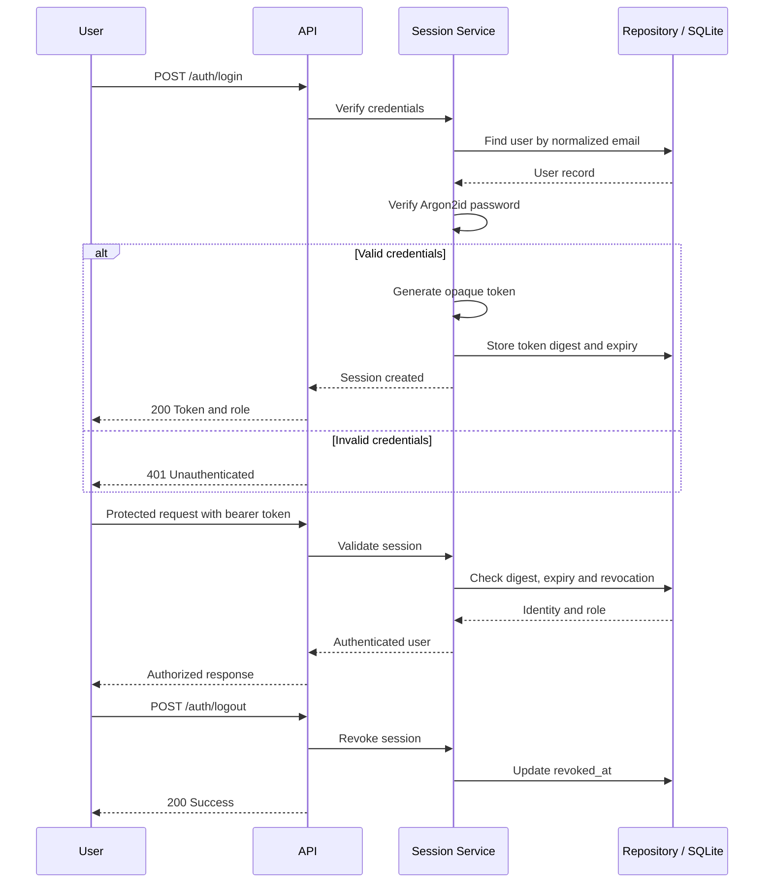

# Login and Session Sequence Diagram

```mermaid
sequenceDiagram
    participant U as User
    participant A as API
    participant S as Session Service
    participant D as Repository / SQLite

    U->>A: POST /auth/login
    A->>S: Verify credentials
    S->>D: Find user by normalized email
    D-->>S: User record
    S->>S: Verify Argon2id password

    alt Valid credentials
        S->>S: Generate opaque token
        S->>D: Store token digest and expiry
        S-->>A: Session created
        A-->>U: 200 Token and role
    else Invalid credentials
        A-->>U: 401 Unauthenticated
    end

    U->>A: Protected request with bearer token
    A->>S: Validate session
    S->>D: Check digest, expiry and revocation
    D-->>S: Identity and role
    S-->>A: Authenticated user
    A-->>U: Authorized response

    U->>A: POST /auth/logout
    A->>S: Revoke session
    S->>D: Update revoked_at
    A-->>U: 200 Success
```

Invalid, expired and revoked sessions return 401.

Related requirements: FR-6, NFR-9, NFR-10.

Reference: SRS Appendix B.5.